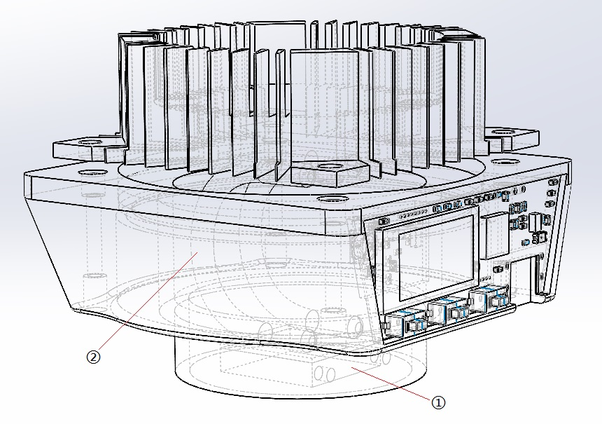
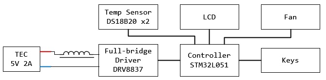
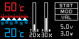
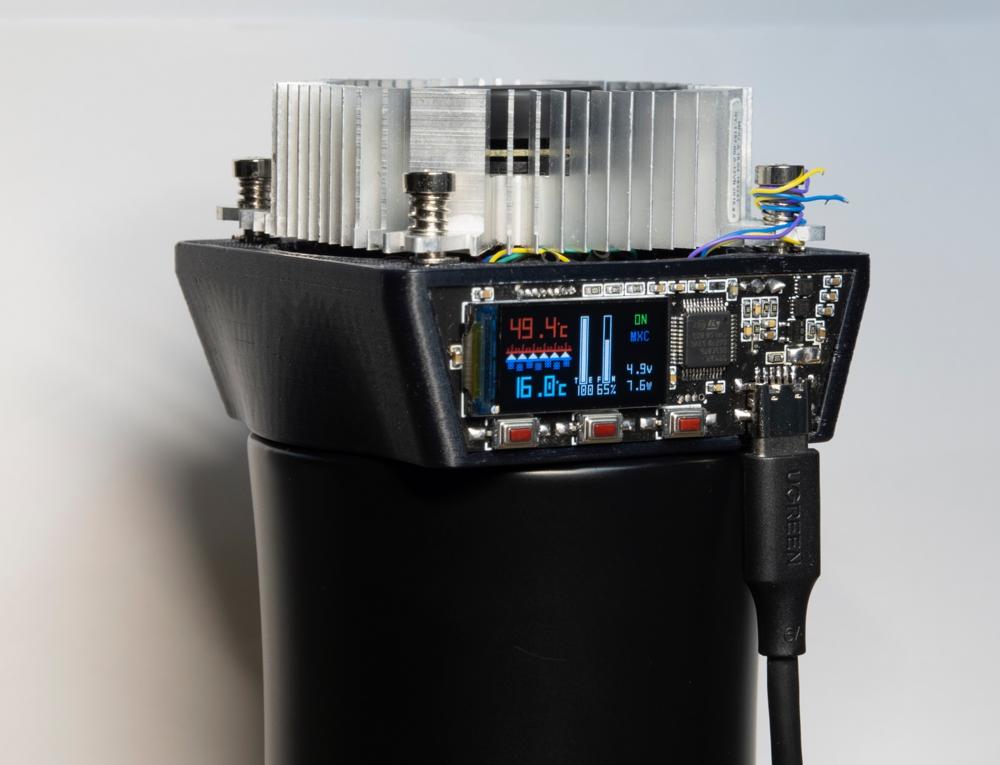

# Thermos-Bottle
有点鸡肋的恒温杯(盖)第一版, 功率有点小，380ml水需要4h才能够下降10℃ ╮(╯▽╰)╭

## 1. 设计
### 1.1 结构

恒温杯盖的结构如上图，其中①所指的方块为半导体制冷片，②为热管。其原理很简单，制冷片的上方与热管紧贴，下方与杯盖内部的金属部分紧贴(①所指的圆柱突出部分在杯子盖起时会深入保温杯内部)。  
1. 当制冷片正向通电时，其下方从杯内吸收热量，上方从杯外放出热量，保温杯处于制冷模式。
2. 当制冷片反向通电时，其上方从杯外吸收热量，下方从杯内放出热量，保温杯处于制热模式。

### 1.2 硬件

电路如上图，半导体制冷片串联电感使其变为感性负载，由全桥驱动芯片DRV8837驱动(~~比较便宜~~实际电路中使用两片并联以降低温升)，驱动方式类似于Buck降压电路，当全桥芯片导通时经由制冷片给电感充电，当全桥芯片关断(两输出引脚同时接地，类似同步整流)时由电感给半导体制冷片续流，使得制冷片在开关周期内能够保持一个较为稳定的电流。

注：电路板中的0Ω电阻R7原为复位按钮，请勿焊接。

### 1.3 软件
软件主要分为三个线程，UI线程、Main线程和Idle线程。UI负责处理按键消息和绘制用户界面；Main线程负责定时读取温度、读取输出电压、计算输出功率、根据当前温度调整输出占空比和将相关参数发给UI等工作；Idle线程负责按键的扫描工作。

## 2. 使用说明
### 2.1 界面
  
界面设计如上图，其中：
- 左侧为半导体制冷片的工作状态及其两端温度，图中下冷上热三角指向上方即处于制冷状态；
- 进度条TE为半导体制冷片的输出占空比；
- 进度条FN为风扇的输出占空比；
- 右上角STAT处显示当前的工作状态，ON为工作中，OFF为停止；
- 右上角MOD处显示当前的工作模式，STAT为恒温模式，MXC为最大功率制冷模式，MXH为最大功率制热模式；
- 右上角VAL处显示恒温模式的温度设定值；
- 右下角5.0V显示当前的输入电压；
- 右下角3.0W显示当前的制冷片功率(估计值)。

### 2.2 操作
电路板上共有三个按键，从左至右分别“模式”，“加”和“减”；
- 长按“模式”后，进入模式设置状态，此时按下“加”或“减”按键可在“恒温”、“最大制冷功率”和“最大制热功率”间循环切换，模式设置完成后，再次点击“模式”按钮退出；
- 在非模式设置状态下，短按“模式”按钮可以切换当前的工作状态(ON/OFF)；
- 在非模式设置状态下，且当前模式为恒温模式时，点击“加”或“减”按钮可以调整恒温温度，长按“加”或“减”可以快速调整恒温温度。

## 3. 其他
### 3.1 参数
- 电压：5.0V
- 电流：2.0A Max
- 最大制冷功率：8W

### 3.2 待办
- 改进电路设计：
  - 增加快充的支持
  - 使用更大功率的制冷片
  - 调整功率元件至单独的铝基板，并使其能够贴在散热片上
- 改进结构设计：
  - 加一个上盖
  - 解决制冷模式下盖子内部积水的问题
  - 解决当保温杯内的水没有接触杯盖时制冷效率低的问题
  - 解决制热效率低的问题

### 3.3 实物图
  